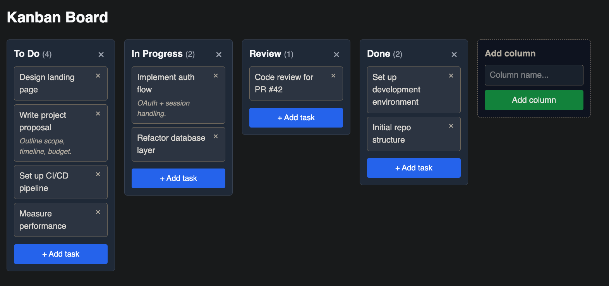

# Kanban board (Local LiveView demo)

A kanban board game implemented fully in Local Live View - see [kanban.ex](local/lib/local/kanban.ex).

Demonstrates simple forms, modals and drag&drop.



## Usage

From the repository root:

```bash
pnpm install
mise run dev --example local-lv-pong
```

or directly from the example directory:

```bash
mix dev
```

and visit [localhost:4000](http://localhost:4000).


