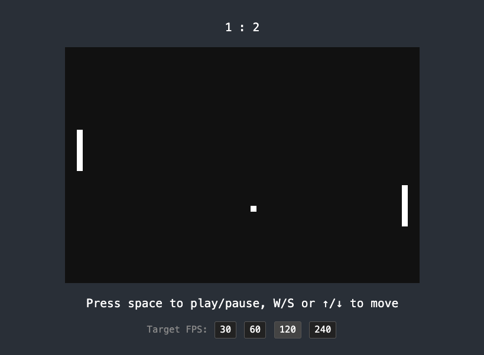

# Pong game (Local LiveView demo)

Pong game implemented fully in Local Live View - see [pong_live.ex](local/lib/local/pong_live.ex).



## Usage

From the repository root:

```bash
pnpm install
mise run dev --example local-lv-pong
```

or directly from the example directory:

```bash
mix dev
```

and visit [localhost:4000](http://localhost:4000).

**Important: when the browser console is opened, the game slows down dramatically.**
That's because the browser switches WASM engine to a debug-friendly one, which
is very slow. Closing the console may not help - you may have to reload the page
or even reopen the tab.

