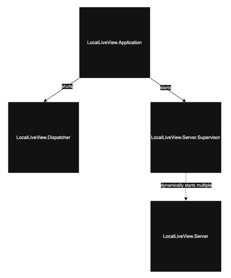

# Welcome
LocalLiveView delivers local-first functionality by merging the powers of [Phoenix LiveView](https://hexdocs.pm/phoenix_live_view/welcome.html) with [Popcorn](https://hexdocs.pm/popcorn/readme.html).
## What is a LocalLiveView?
LocalLiveView is a project that aims to store the LiveView state in the browser in a virtual machine provided by Popcorn.
It allows to store, update and render the assigns similarly to Phoenix LiveView.
## Architecture
### Popcorn part
Local Live View is running on AtomVM in WASM in the browser using erlang virtual machine.
It is built as an Elixir project with a supervisor tree.

- LocalLiveView.Application starts LocalLiveView.Dispatcher and LocalLiveView.Server.Supervisor.
- LocalLiveView.Dispatcher is an entry point for Popcorn to handle messages from JS.
On start, it receives all names of LocalLiveViews present on the page and for each view it creates a LocalLiveView.Server process.
- LocalLiveView.Server.Supervisor is a dynamic supervisor that is used by LocalLiveView.Dispatcher
to create LocalLiveView.Server processes dynamically.
- LocalLiveView.Dispatcher handles messages from JS that contain Phoenix events by dispatching them to
correct LocalLiveView.Server processes.
- LocalLiveView.Server handles the phoenix events and rerenders the LocalLiveView if needed.
- LocalLiveView.Renderer is used by LocalLiveView.Server to rerender LocalLiveView.
It is done by replaceing innerHTML of div marked as a LocalLiveView (the div must have 
`data-pop-view="ExampleViewLocal"` attribute) with a new HTML body generated by the Phoenix code.
- All the files in `lib/necessary_phoenix` directory are copies of the Phoenix Framework code.
It is used to generate new HTML body for LocalLiveView that will be rendered into the marked div.
- LocalLiveView.Server stores the state (socket and assigns) of the LocalLiveView.
It fills a similar role to the Phoenix's channel in Phoenix Live View.

### JS part

- LocalLiveView JS functionality is implemented in `priv/static/local_live_view.js`.
- It is responsible for sending initial request to LocalLiveView.Dispatcher to create all LocalLiveViews 
present on the page using `popcorn.call()`.
- It also sends registered events to LocalLiveView.Server also using `popcorn.call()`.
- Events are registered on the page by adding `addEventListener` function to the element with 
"pop-\<event\>" attribute where \<event\> is a browser event (`click`, `change`, `input` etc.).
- When the event listener is added to the element with "pop-event" attribute 
the closest LocalLiveView is found by checking every ancestor if it is marked with `data-pop-view` attribute.
That way, when the event is triggered, the Phoenix event sent via `popcorn.call()` reaches the correct LocalLiveView.Server.