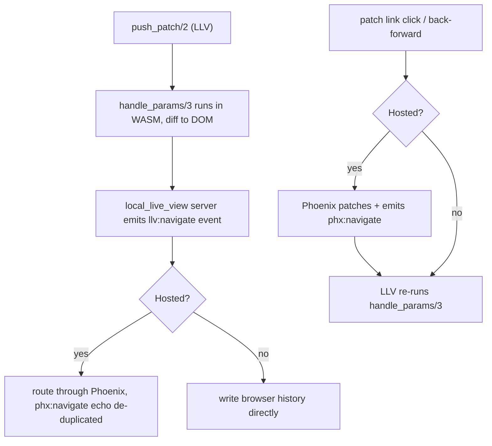

# Navigation

LocalLiveView supports patch navigation: updating the URL and re-running
`handle_params/3` without a full page reload. The state update runs in the WASM
VM, so it needs no network call; the URL change is coordinated between the Elixir
code running in WASM, the Phoenix LiveView JavaScript runtime, and the browser.

## Two modes

Navigation behaves differently depending on how an LLV view is rendered.

* **Hosted** - the LLV view is rendered as a child of a connected Phoenix
  LiveView. Phoenix already owns the browser history, the `popstate` handler and
  the click handler for patch links. LLV routes its navigation through Phoenix
  and listens for the resulting `phx:navigate` event to re-run `handle_params/3`
  in its own views.

* **Standalone** - the LLV view is rendered directly in a HEEx or HTML template,
  with no host LiveView on the page. There is nothing from Phoenix to lean on, so
  LLV owns navigation itself: it intercepts patch-link clicks, writes the browser
  history entry, and handles `popstate`.

The same `<.link patch={...}>` markup works in both modes. `<.link href={...}>` and
`<.link navigate={...}>` are handled by Phoenix LiveView as usual and are not affected
by LLV.

## `handle_params/3`

A view opts into navigation by exporting `handle_params/3`, mirroring
`Phoenix.LiveView`. It receives the current query params and URL.

```elixir
def handle_params(params, uri, socket) do
  {:noreply, assign(socket, :tab, params["tab"] || "home")}
end
```

It runs at mount with the initial query params, and again on every patch
navigation.

## `push_patch/2`

`LocalLiveView.push_patch/2` mirrors `Phoenix.LiveView.push_patch/2` and is used
to navigate from Elixir:

```elixir
def handle_event("select_tab", %{"tab" => tab}, socket) do
  {:noreply, push_patch(socket, to: "/dashboard?tab=#{tab}")}
end
```

The state update happens client-side: `handle_params/3` runs in the WASM VM and
its diff is applied to the DOM with no network call. The WASM side then emits an
`llv:navigate` event, and how the history entry is written depends on the mode:

* **Standalone** - the JS layer writes the browser history entry directly. No
  server is involved.
* **Hosted** - the `llv:navigate` event hands the navigation to Phoenix, which
  does a server round-trip to update the history it keeps on the LiveView side.
  This round-trip is triggered after LLV emits `llv:navigate`, not as part of the
  `push_patch/2` state update itself.

As in a normal Phoenix LiveView, clicking a `<.link patch={...}>` also invokes
`handle_params/3` with the new params. The behaviour is identical to LiveView, so
the same link works without any LLV-specific markup.

## `phx:navigate`

In hosted mode, Phoenix emits a `phx:navigate` event whenever it performs a patch
(a patch-link click or browser back/forward). Its purpose here is to pass those
Phoenix navigation events into the LLV views, which re-run `handle_params/3` in
response. Patches that LLV itself initiated via `push_patch/2` are de-duplicated,
so `handle_params/3` is not run twice for the same navigation.

## Flow



## Customizing navigation

`LLVEngine.create/2` accepts an `onNavigate` callback in its config. It overrides
LLV's default handling of an Elixir-initiated `push_patch/2`, letting you take
full control of the browser history (for example, to integrate with a custom
router).

  * arguments: `(href, replace)` - the target URL and whether the entry should
    replace the current one instead of being pushed
  * scope: only the `push_patch/2` path. Patch-link clicks and back/forward
    navigation are unaffected.
