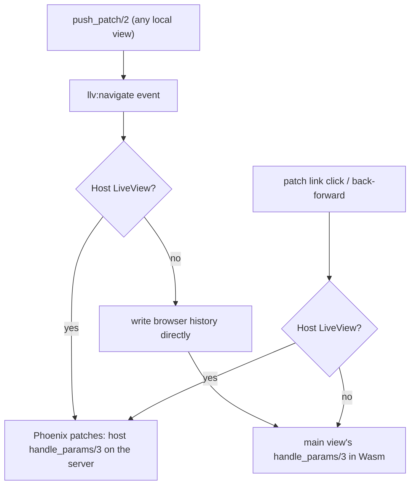

# Navigation

LocalLiveView supports patch navigation: updating the URL and re-running
`handle_params/3` without a full page reload. Navigating to another page, with
`<.link navigate={...}>` or `<.link href={...}>`, goes through the server as
usual.

## The main view

Like in Phoenix LiveView, where only the LiveView mounted at the router gets
`handle_params/3`, only the **main** local view of a page gets it. The main view
is the one mounted by a `LocalLiveView.Router.live_local/2` route:

```elixir
live_local "/dashboard", DashboardLocal
```

Views rendered with `<.local_live_view>` - inside a host LiveView or in a plain
template - are not main and don't get `handle_params/3`, just like child
LiveViews don't. If they need the URL params, have the host pass them down as
assigns.

Any local view can patch the URL, though. The patch goes to whoever owns the
page:

- **A main local view** - the page has no host LiveView, so LLV owns navigation
  itself: it intercepts patch-link clicks, writes the browser history entry,
  handles `popstate`, and runs `handle_params/3` in the main view, in the Wasm
  VM, with no network call.

- **A host LiveView** - Phoenix owns the browser history, the `popstate` handler
  and the click handler for patch links. LLV routes its patches through Phoenix,
  and the host LiveView handles them in its `handle_params/3`, on the server.

The same `<.link patch={...}>` markup works in both cases.

## `handle_params/3`

The main view opts into navigation by exporting `handle_params/3`, mirroring
`Phoenix.LiveView`. It receives the current query params and URL.

```elixir
def handle_params(params, uri, socket) do
  {:noreply, assign(socket, :tab, params["tab"] || "home")}
end
```

It runs at mount with the initial query params, and again on every patch
of the page URL. It also runs when the view is rendered on the server.

## `push_patch/2`

`LocalLiveView.push_patch/2` mirrors `Phoenix.LiveView.push_patch/2` and is used
to navigate from Elixir:

```elixir
def handle_event("select_tab", %{"tab" => tab}, socket) do
  {:noreply, push_patch(socket, to: "/dashboard?tab=#{tab}")}
end
```

The Wasm side emits an `llv:navigate` event, and what happens next depends on
who owns the page:

- **A main local view** - the JS layer writes the browser history entry directly
  and `handle_params/3` runs in the main view. When the main view patches
  itself, its `handle_params/3` runs right away, as part of the `push_patch/2`
  state update. No server is involved.
- **A host LiveView** - the `llv:navigate` event hands the patch to Phoenix,
  which does a server round-trip: the host's `handle_params/3` runs and Phoenix
  updates the history. The host can then pass the new params down to the
  local view as assigns.

## `redirect/2`

`LocalLiveView.redirect/2` mirrors `Phoenix.LiveView.redirect/2`: it performs a
full-page redirect to a path or an external URL:

```elixir
def handle_event("checkout", _params, socket) do
  {:noreply, redirect(socket, to: "/checkout")}
end
```

The difference from server-side redirect is that Flash isn't carried over
to the next page. If that's required, use `LocalLiveView.push_server_event/3`
and trigger the redirect on the server.

`push_navigate/2` is not supported. A live redirect mounts another LiveView
over the existing socket through the router, and local views are not mounted
at a router. Calling it logs an error and is ignored.

## Flow


```mermaid
flowchart TD
    PP["push_patch/2 (any local view)"] --> EMIT["llv:navigate event"]
    EMIT --> H{Host LiveView?}
    H -- yes --> PHX["Phoenix patches: host handle_params/3 on the server"]
    H -- no --> HIST["write browser history directly"] --> MAIN["main view's handle_params/3 in Wasm"]

    CLICK["patch link click / back-forward"] --> H2{Host LiveView?}
    H2 -- yes --> PHX
    H2 -- no --> MAIN
```

## Customizing navigation

`LLVEngine.create/2` accepts an `onNavigate` callback in its config. It overrides
LLV's default handling of an Elixir-initiated `push_patch/2`, letting you take
full control of the browser history (for example, to integrate with a custom
router).

- arguments: `(href, replace)` - the target URL and whether the entry should
  replace the current one instead of being pushed
- scope: only the `push_patch/2` path. Patch-link clicks and back/forward
  navigation are unaffected.
