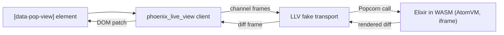

# JavaScript API

LocalLiveView ships a small JavaScript bridge, `LLVEngine`, that runs in the
page alongside the Phoenix LiveView client. It is what makes a
`<.local_live_view>` mount point come alive: it boots the Popcorn WASM runtime
and makes the LiveView client talk to Elixir code running in the browser
instead of to a server.

`mix llv.install` wires it up for you, so most applications only ever see the
two lines it adds to `assets/js/app.js`. This page documents the whole public
surface for the cases where you need more: custom navigation, pushing events
into a view from your own JavaScript, or reacting to a reconnect.

## How it fits together

The LiveView client is built around one assumption: a channel on the other end
of a WebSocket answers its pushes with rendered diffs. LLV keeps that
assumption and replaces only the other end. It hands the client a Phoenix
`Socket` over a transport that never touches the network, and answers frames
from Elixir running in a WASM VM.



Because the LiveView client is untouched, everything it already does keeps
working inside an LLV view: `phx-click`, forms, `phx-update`, JS commands,
LiveComponents. What LLV adds is the boot sequence, the fake transport, and a
handful of bindings LiveView does not bind natively.

The WASM VM runs inside an iframe, which is why LLV applications must serve
COOP/COEP headers. `mix llv.install` adds them to your endpoint.

## Importing

```javascript
import { LLVEngine } from "local_live_view";
```

The bare specifier resolves because Phoenix's esbuild configuration puts
`deps/` on `NODE_PATH`, and the `local_live_view` Hex package ships a
prebuilt ESM bundle plus an `exports` entry pointing at it. Nothing is built
on your machine and no npm dependency is involved.

Two configuration details are required and are handled by the installer:

* esbuild needs `--format=esm`, since the bundle is ESM.
* the `app.js` script tag needs `type="module"`, since `LLVEngine.create()` is
  awaited at the top level.

When you depend on `local_live_view` as a path or git dependency, Mix does not
materialize it into `deps/`, so the installer instead adds an
`--alias:local_live_view=...` flag pointing at the bundle. See
[Installation](installation.md) for the full list of what gets configured.

## `LLVEngine.create(liveSocket, config)`

Boots the engine. Returns a `Promise` that resolves to the `LLVEngine`
instance once the WASM runtime is up and every LLV view already in the DOM has
been mounted.

```javascript
import { LLVEngine } from "local_live_view";

const engine = await LLVEngine.create(liveSocket, {
  bundlePaths: ["/assets/js/wasm/bundle.avm"],
});
```

* `liveSocket` - the `LiveSocket` instance your `app.js` already created. The
  engine reads the application's Phoenix `Socket` class off it, so there is
  nothing to import or pass in.
* `config` - optional, see [`LLVConfig`](#llvconfig) below.

`create()` does not call `liveSocket.connect()`; you keep owning that. It works
called either before or after `connect()` - the installer places it after.

Keep the resolved instance around if you plan to use
[`pushEvent`](#engine-pushevent-viewid-event-payload). The examples in this
repository store it on `window`:

```javascript
window.llvEngine = await LLVEngine.create(liveSocket, {
  bundlePaths: ["/assets/js/wasm/bundle.avm"],
});
```

### `LLVConfig`

All fields are optional.

| Field | Type | Default | Description |
|---|---|---|---|
| `bundlePaths` | `string[]` | `["wasm/bundle.avm"]` | Paths to the compiled WASM bundles to load. `mix llv.build` writes the bundle to `priv/static/assets/js/wasm/bundle.avm`, which is why the installer passes `["/assets/js/wasm/bundle.avm"]`. |
| `debug` | `boolean` | `false` | Enables Popcorn debug logging. |
| `eventHandler` | `(eventName, payload) => void` | - | Called for every raw message the Popcorn runtime emits, including messages that are not part of the LLV protocol. Useful for diagnostics. |
| `onNavigate` | `(href, replace) => void` | - | Replaces LLV's default handling of an Elixir-initiated `push_patch/2`. See [Navigation](navigation.md#customizing-navigation). |

## `engine.pushEvent(viewId, event, payload)`

Sends an event from your own JavaScript into a running LLV view.

```javascript
await engine.pushEvent("ThermostatLive", "refresh", { source: "toolbar" });
```

* `viewId` - either the view name as written in `<.local_live_view view="...">`
  or the mount element's `id`. A view name is resolved against the first
  matching `[data-pop-view]` element, so prefer the element `id` when the same
  view is rendered more than once on a page.
* `event` - the event name.
* `payload` - optional map, defaults to `{}`.

On the Elixir side the event arrives at the view's `c:LocalLiveView.handle_info/2`
as a three-element tuple, not at `handle_event/3`:

```elixir
def handle_info({:js_push, "refresh", payload}, socket) do
  {:noreply, assign(socket, :source, payload["source"])}
end
```

The returned promise resolves once the runtime has accepted the event. It
**never rejects**: a failure - unknown view, runtime error, timeout - is
reported to `console.error` and the promise still resolves. Do not use it to
detect delivery failures.

## What `create()` changes in your page

`create()` is not inert. Knowing what it touches makes surprising behaviour
much easier to place.

* **Registers two LiveView hooks** on `liveSocket.hooks`: `LocalLiveView`,
  which mounts, updates and unmounts a view as its element enters and leaves
  the DOM, and `LocalLiveViewEventBus`, a hidden sibling element used to send
  events from a local view to the host LiveView. Both are rendered by
  `<.local_live_view>`; you do not add them yourself. Because they are
  registered on the instance, they do not need to appear in the `hooks` option
  you pass to `new LiveSocket(...)`.
* **Patches `liveSocket.owner`** so that DOM events originating inside a
  `[data-pop-view]` subtree are dispatched to the local view rather than to the
  surrounding server LiveView. LLV mount points deliberately carry no
  `data-phx-session`, so Phoenix's own lookup would otherwise walk past them.
* **Adds bindings LiveView does not bind natively**: `phx-mousedown`,
  `phx-mouseup`, `phx-mousemove`, `phx-mouseover`, `phx-mouseout`, their
  `phx-window-*` counterparts, and the HTML5 drag bindings `phx-dragstart`,
  `phx-dragenter`, `phx-dragover`, `phx-dragleave`, `phx-drop`, `phx-dragend`.
  Each handler receives pointer data plus the binding element's bounding rect,
  so position-dependent handlers (drag targets, sliders) can compute offsets.
  These bindings work inside LLV views only.
* **Calls `liveSocket.bindForms()` when the page has no host LiveView.** Such
  pages connect in dead mode, which skips form binding and would leave
  `phx-submit` and `phx-change` inert on every LLV view.
* **Boots the Popcorn runtime**, creating the AtomVM iframe. This is the step
  that requires COOP/COEP headers.
* **Mounts every `[data-pop-view]` currently in the DOM.** Views added later
  are mounted by the `LocalLiveView` hook, and views whose hook fired while the
  runtime was still booting are caught by this scan.
* **Opens a mirror socket at `/llv_socket`**, but only if at least one mounted
  view carries a `data-pop-mirror-id` - that is, only if it has a server-side
  `Mirror` module. Pages without mirrors open no extra socket.

## Communicating with the host LiveView

Once the engine is running, four channels of communication exist between the
page, the host LiveView and the Elixir code in WASM. Only the first requires
JavaScript from you.

**Host LiveView to local view.** Your host LiveView pushes a `llv_server_message`
event; the engine routes it to the addressed view, which handles it in
`handle_server_event/3`. The library has no server-side helper, so the push is
written by hand:

```elixir
push_event(socket, "llv_server_message", %{
  "view" => "CartLive",
  "payload" => %{"type" => "items_updated", "items" => items}
})
```

* `"view"` addresses the target: a view name or a mount element `id`, resolved
  the same way as in [`pushEvent`](#engine-pushevent-viewid-event-payload).
* `"payload"` **must contain a `"type"` key**. `use LocalLiveView` generates a
  `handle_event("llv_server_message", ...)` clause that matches on it and calls
  `handle_server_event(type, payload, socket)`; a payload without `"type"` never
  reaches `handle_server_event/3`.

The local view receives the type as the first argument and the full payload as
the second:

```elixir
def handle_server_event("items_updated", %{"items" => items}, socket) do
  {:noreply, assign(socket, :items, items)}
end
```

`handle_server_event/3` is an overridable function generated by
`use LocalLiveView`, not a declared callback, so it takes no `@impl true`. The
default implementation ignores the event.

Messages that arrive while the runtime is still booting are buffered and
flushed after it comes up, so a push during the initial LiveView join is not
lost.

**Local view to host LiveView.** `LocalLiveView.push_server_event/3` sends an
event through the hidden event bus element to the host LiveView's
`handle_event/3`. If the push fails - no host LiveView on the page, socket
disconnected, error reply, timeout - the view's
`c:LocalLiveView.handle_push_error/4` runs so it can roll optimistic edits
back.

**Assigns from the host.** `<.local_live_view view="Cart" items={@items} />`
re-renders on the host as usual; the `LocalLiveView` hook notices the changed
assigns and forwards them, which runs the local view's `c:LocalLiveView.update/2`.

**Mirror sync.** `LocalLiveView.mirror_sync/2` pushes the declared assigns over
the `/llv_socket` channel to the view's `Mirror` module. See
[Mirror Sync](mirror-sync.md).

## Reconnects

When the mirror channel joins successfully, the engine tells the view to
re-sync, which runs `mirror_sync/2` over all of its assigns. Mirrored state
therefore recovers on its own after the mirror socket comes back, with no
JavaScript on your side.

A host LiveView remounting is a different event, and one the engine cannot
observe on the view's behalf: the local view kept running through the outage,
so the freshly mounted host knows nothing about its state. If your views need
to push state back after that, drive it from your reconnect handling:

```javascript
document
  .querySelectorAll("[data-pop-view][data-pop-mirror-id]")
  .forEach((el) => {
    window.llvEngine?.pushEvent(el.id, "llv_reconnected", {});
  });
```

This arrives as `{:js_push, "llv_reconnected", %{}}` in the view's
`c:LocalLiveView.handle_info/2`, so the view decides what to re-send - it does
not reuse the built-in mirror re-sync above.

## TypeScript

The package ships type declarations next to the bundle, so `LLVEngine` and
`LLVConfig` are typed with no `@types` package. For path or git dependencies,
`mix llv.install` adds a `compilerOptions.paths` entry to `assets/tsconfig.json`
pointing at the shipped `.d.ts`; for a Hex dependency, normal `node_modules`
resolution finds it.

## Internals

The engine also installs `window.__popcornTransportReceive`, `window.__llvSync`
and `window.__llvPushServer`, and internally uses a fake Phoenix transport and
a Popcorn client wrapper. These are the wire between Elixir in WASM and the
page, called from `Popcorn.Wasm.run_js` inside the library. They are
implementation details: they are unstable, undocumented by design, and can
change in any release. `LLVEngine.create()` and `engine.pushEvent()` are the
only supported entry points.
