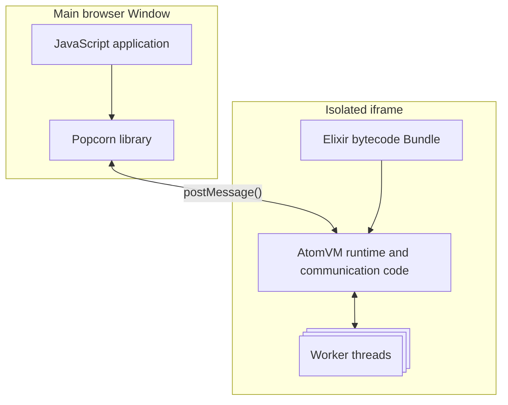
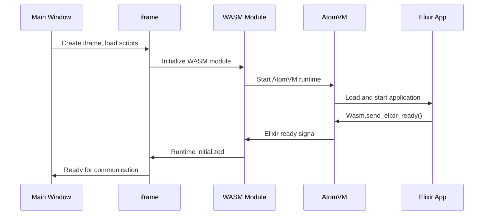

## Main Architecture

Popcorn runs Elixir code in web browsers by compiling the AtomVM runtime to WebAssembly (Wasm) and executing user code bundle within an isolated iframe environment.

The main browser window hosts your JavaScript code and the Popcorn client JS library. The communication with iframe happens through the `postMessage()` API.

Executing Wasm module in iframe prevents crashes from affecting the main application and enables independent error handling (e.g. restarting the module in case of hangs). The iframe loads the Wasm module which initializes AtomVM and loads your compiled Elixir bytecode.

## Patching Mechanism

Popcorn uses a custom patching mechanism to make Elixir and Erlang standard library work with AtomVM's limitations.

The patching system:

1. Takes `.beam` files from known versions of Erlang and Elixir
2. Decompiles them, adding custom patches to work around missing functionality in AtomVM
3. Adds custom modules like `:emscripten` to the standard library
4. Recompiles all of them and bundles into `.avm` bytecode bundle

The patching is currently not exposed to users.

## Runtime Initialization diagram

